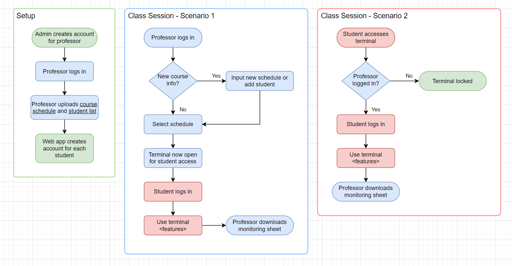

# lab-monitoring



- ? admin adds instructor emails to whitelist
- ? instructor adds student emails to whitelist


## Auth0

1. Create a [Vue Login App](https://auth0.com/docs/quickstart/spa/vuejs) via Auth0 website to manage logins of the frontend
2. Follow quickstart instructions for [**configuring**](https://auth0.com/docs/quickstart/spa/vuejs#configure-auth0) your Auth0 App
3. Get domain and client_id of your Auth0 app and store to .env (see .env.example inside the frontend directory)
4. Go to `Dashboard > User Management > Roles` and create the following roles:
   - `Teacher` - Supervises activities during a laboratory session 
   - `Student` - Interacts with laboratory materials for learning purposes
5. Go to `Dashboard > Auth Pipeline > Rules`, and create the rule:
   - `Access Control > Whitelist` - this is where the admin (auth0 app creator) will add teacher emails to enable access to the lab-monitoring app.

#### Config

1. Rules

   1. Add access control

      - `Check if user email domain matches configured domain` (@ue.edu.ph)
      - `Set roles to a user`

   2. Enrich profile

      - `Add user roles from a SQL Server database`

      - `Default picture for null avatars`

      - `Enrich profile with the locations where the user logs in`

   3. Webhook

      - `Track Logins in MixPanel` or `Track Logins and signups with Splunk HEC`


## Frontend

Install dependencies
```sh
npm install
```

Start the app in development mode (hot-code reloading, error reporting, etc.)
```sh
quasar dev
```

Lint with [ESLint](https://eslint.org/)
```sh
npm run lint
```

Format the files

```sh
npm run format
```

Build the app for production

```sh
quasar build
```

Customize the configuration, see [Configuring quasar.config.js](https://v2.quasar.dev/quasar-cli-vite/quasar-config-js).


## In Production

### Google-oauth2

1. Configure keys: replace Auth0 development key with own key via `App Dashboard > Social`  


## Docs

### Auth0

- [User Profile Structure](https://auth0.com/docs/manage-users/user-accounts/user-profiles/user-profile-structure)

### Vue JS 3

- [Quickstart](https://vuejs.org/guide/quick-start.html#with-build-tools)
- [Hands-on tutorial](https://vuejs.org/tutorial/#step-1)
- [Examples](https://vuejs.org/examples/#handling-input)
- [Vue Router](https://router.vuejs.org/guide/#javascript)
- [[Article] Vue Lifecycle Hooks](https://michaelnthiessen.com/call-method-on-page-load/)
- [Vue Awesome](https://github.com/vuejs/awesome-vue)
- [History Modes, e.g.: http://localhost:9000/#/dashboard](https://router.vuejs.org/guide/essentials/history-mode.html)

### Quasar v2

- [Configuring Quasar App](https://quasar.dev/quasar-cli-webpack/quasar-config-js)
- [Quasar App Flow](https://quasar.dev/quasar-cli-webpack/boot-files#quasar-app-flow)
- [Boot Files](https://quasar.dev/quasar-cli-webpack/boot-files#usage-of-boot-files)
- [Quasar Awesome](https://github.com/quasarframework/quasar-awesome)

### JavaScript ES6

- [Pretty print](https://stackoverflow.com/questions/18184559/how-to-pretty-print-log-output-in-chrome-devtools-console)

### Material Icons

- https://fonts.google.com/icons?selected=Material+Icons
